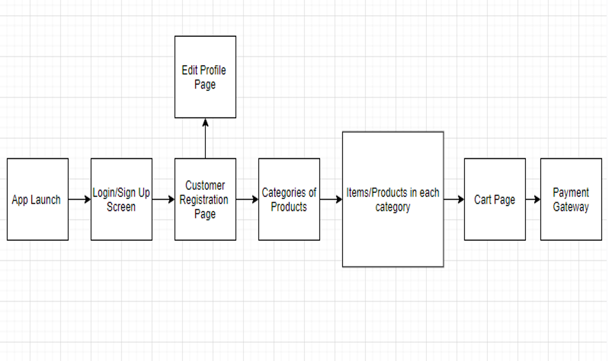
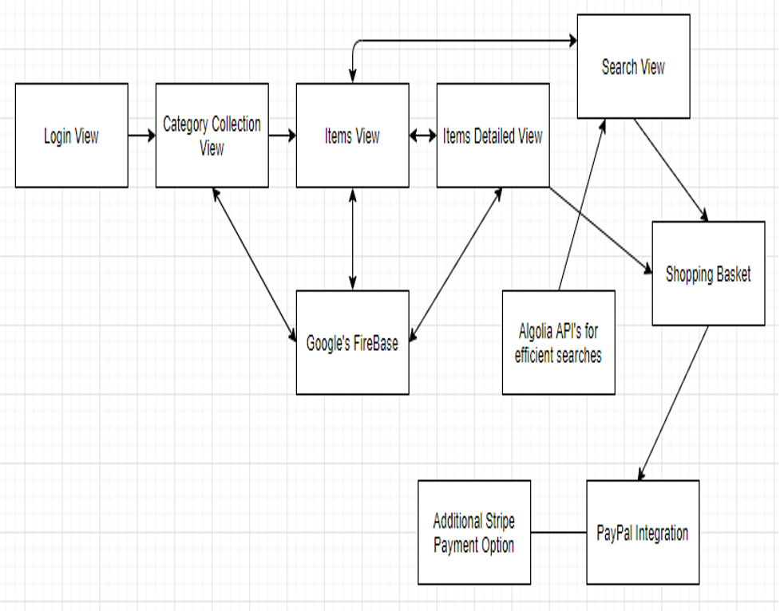

# iOSMarketplace
An iOS app to buy products online

# Smartphone Application Development

**Team** : **Ananth Upadhya (015234726) , Deesha Desai (015135536)**

**Team Application** : An e-commerce iOS app built for making online shopping easy by providing multiple categories of products and list of items in each category thereby helping the user/customer to purchase the products. The user can checkout the items to the cart and can pay the bill through online Stripe account.

**App Name** :- **BuyOnTheGO**

**App Icon** :-

**Your design**

App Flow Architecture

- **Logic Flow and Functionalities:**

We are building an e-commerce iOS application to make modern-day shopping easier. Our app caters to multiple categories of products ranging from daily needs to automobiles.

We plan to use Google's Firebase for our user authentication, data storage, messaging, and usage statistics and Algolia API&#39;s for efficient searches on the items page.

**Sign up and Login page** :

The user will first launch the app and then can sign in or sign up. In the sign-up page, the user will fill all the user details like First Name, Last Name, Address, Phone Number and Email.

A confirmation email is sent to the user, upon which the user&#39;s account is activated. Once the user registers, the user can then login to the app through the sign-in page.

**Home/Categories Page** :

This is the first page of the application which shows multiple categories of the items like Clothing and Accessories, Jewelry, Bags, Electronics, Footwear, and much more. Upon selection of a category, the user can view all the products in that category.

**Items List View** :

In this page, all the items based on the selected category will be displayed. The name of the item, images of the item, price, and brief description of items are displayed in the form of a list.

We also plan to add an admin view to the portal where the app admin can add the items under each specific category. To add an item to a specific category, the admin needs to provide item name, item cost, description of the item, and item image/s.

**Item Detail View** :

When a user clicks on an item on the Items list page, the user will be redirected to Item Detail Page. In this page, all the details of the item like item name, images, price, and full description will be displayed. Also, a button will be available, to add this item to the cart. But to add an item to the cart, the user will have to log in to our app.

**Search View** :

There is a search button in the foot bar of the app. When the user clicks on the search button, the user will be redirected to the Search page, where a search bar is available for the user to search for any items in the list. When the user enters a search text, all the items with that name will be displayed as a list view. Clicking on an item will redirect the user to its details page.

**Cart View** :

• The user can see the items added to the cart by clicking on the cart icon button present in the foot bar. This view will display the items in the cart in the form of a list and also display the cumulative price that the user has to pay. The user can delete an item from this cart by swiping-left on the item.

• A checkout button is provided in the cart view. Clicking on this button will redirect the user to Stripe modes of payment to make the payment. Once the user has logged into Stripe and has made a successful payment, the items from the cart will be removed and the order is successfully placed.

**Profile View** :

The user can go to his/her profile details by clicking on the profile button on the foot bar.

• Purchase history:

The user can see his previous orders by clicking on the Purchase history button, inside the profile view.

• Accounts status:

When the user registers to our app, an email will be sent to the user to confirm his email address. Only then his account is considered to be active, and the status is shown as Active in this section.

• Edit profile:

The user can edit his/her profile details like name, address, email ID and phone number.

**Architecture**

**Task distribution/assignment**

Initial Setup and Environment Setup **Ananth and Deesha**

**Ananth Upadhya** :-

1. Items View Controller, Items Class
2. ItemsDetail View
3. Login View
4. SearchView

**Deesha Desai** :-

1. Category class, Category Collection View
2. Shopping Basket
3. Purchase History
4. Adding Stripe Payment Option
